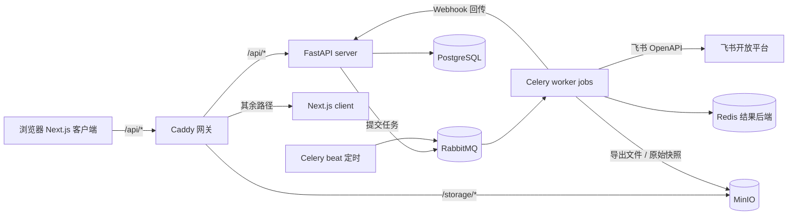
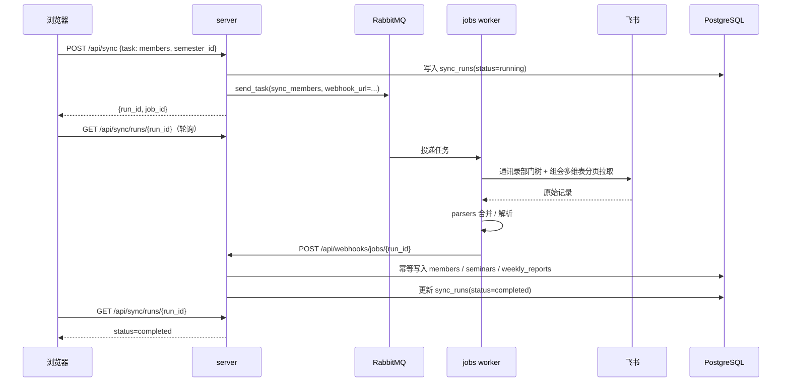

# 架构

SMC-Web-Agent 把 SMCLabDailyManager 的「命令行 + 本地 Excel/JSON」形态改造成「Web 应用 + 数据库」。数据源仍然是飞书开放平台，运行形态分为三个应用，全部由 Docker Compose 编排。

## 1. 三个应用

| 应用 | 目录 | 职责 | 技术栈 |
| --- | --- | --- | --- |
| 客户端 | `client/` | 页面与交互，不直连飞书 | Next.js 15、TypeScript、Tailwind v4、shadcn/ui |
| 服务端 | `server/` | 同步 HTTP API、业务编排、渲染消息模板、数据库读写 | FastAPI、SQLAlchemy 2、Alembic |
| 异步任务 | `jobs/` | 飞书网络 I/O、全量分页爬取、消息发送、定时触发 | Celery（worker / beat）、FastAPI 状态接口 |

加上基础设施：PostgreSQL（业务数据）、RabbitMQ（Celery broker）、Redis（Celery 结果后端）、MinIO（对象存储）、Caddy（网关）。



## 2. 边界铁律

**耗时、易失败、需要重试的飞书调用绝不进同步 API 请求路径。**

- `client` 只通过 `fetchFromApi` 调用 `/api/*`，永不持有飞书凭据。
- `server` 的 API 层只做「校验 + 落库 + 提交任务」，一个请求最多几百毫秒。
- `jobs` 才持有飞书 `app_id` / `app_secret`，负责网络重试、分页与错误上报。
- 同步任务写入的实体（`members` / `seminars` / `weekly_reports`）由 server 的 webhook 端点落库，jobs 不直接写业务表；它只读 `runtime_configs` 拿凭据（`jobs/src/runtime_config.py`）。
- 原始响应快照上传 MinIO（等价于原项目的 `data_raw/`）目前只是预留能力，尚未接线；排查问题看 `sync_runs.error` 与 worker 日志。

## 3. 飞书同步链路

以「同步人员主数据」为例：



要点：

- 任务契约：`server` 把 `semester_id`、周次、多维表 `app_token`/`table_id`、`webhook_url` 作为 kwargs 传入，`jobs` 保持无状态。
- 幂等：`webhook_api` 对每个 `run_id` 取 PostgreSQL advisory lock，重复回传不会写两遍。
- 失败：任务内部捕获异常后回传 `status=failed` 与错误文本，`sync_runs.error` 供前端展示。

## 4. 消息推送链路

组会预告与周报总结的文案由 `server` 渲染（`server/app/feishu/renderer.py` + JSON 模板），发送动作交给 `jobs`：

1. `server` 渲染出飞书 `post` 消息体，先写入 `notifications(status=pending)`。
2. `server` 提交 `send_feishu_message` 任务，附带 `notification_id`。
3. `jobs` 调用飞书 IM API 发送，回传 `sent` 或 `failed`。
4. `server` 更新 `notifications.status` / `error` / `sent_at`，「推送历史」页可追踪。

预览与推送共用同一渲染函数，保证「看到的」和「发出去的」一致。

## 5. 数据模型

`server/app/database/models.py` 是唯一的事实来源，Alembic 迁移由它推导：

- `users` / `sessions` — 本地账号与登录会话。
- `semesters` — 学期主配置：起始日期、默认组会参数、四张多维表的 token。
- `members` — 人员主数据（通讯录与组会表合并结果）。
- `seminars` / `seminar_presentations` — 组会发生与讲者（Track 沿用组会表 `_Track` 值，允许跳号；场次还带线下地点、线下指导老师，以及可选的场次时间覆盖）。
- `seminar_leaves` / `schedule_entries` — 请假与课表（考勤模块预留）。
- `weekly_reports` — 每周周报提交记录。
- `attendance_groups` / `attendance_group_members` — 考勤组（预留）。
- `notifications` — 推送记录。
- `sync_runs` — 同步任务运行记录。
- `runtime_configs` — 加密存储的飞书凭据。

配置分三层：`.env` + Pydantic Settings（部署参数与密钥）、`semesters` 表（每学期的业务参数）、JSON 模板（消息文案）。

## 6. 目录速查

```text
server/app/
├── main.py              FastAPI 入口：load_dotenv → configure_logging → include_router
├── api/                 HTTP 薄层（校验 + 提交任务）
├── auth/                本地账号鉴权
├── database/            models / crud / session
├── feishu/              模板装载与消息渲染
├── helpers/             日历、S3、Celery 客户端、加密配置、定时任务编排
└── schemas/             Pydantic 请求/响应

jobs/src/
├── celery_app.py        broker / backend / 队列 / beat 调度
├── app.py               任务状态与健康检查 API
├── feishu/              飞书 HTTP 客户端（contact / bitable / attendance / message）
├── parsers/             通讯录合并、组会构建、周报解析
├── tasks.py             Celery 任务
└── webhook.py           回传 server

client/src/
├── app/(main)/          应用外壳 + login
├── app/(main)/(protected) 受保护页面
├── components/          外壳、业务组件、ui 原语
├── hooks/               数据 hook
└── lib/                 api / auth / schema / utils
```

## 7. 进一步阅读

- [deployment.md](deployment.md) — dev/prod 双栈与日常操作
- [feishu-integration.md](feishu-integration.md) — 飞书应用权限与凭据
- [../src_doc/](../src_doc/) — 核心模块实现原理
