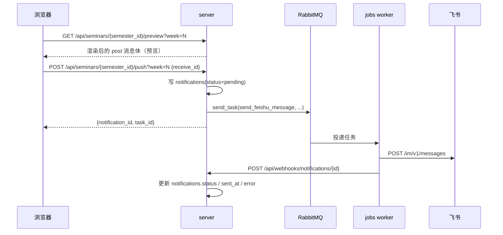

# 组会预告推送原理

组会表是「一人一行」的排班表：每个人记录**上次讲组会的时间**和**近期预期讲的时间**。要变成一条群里的预告，需要经过「展开成场次 → 归并去重 → 编号校对 → 填模板 → 发消息」五步。

## 1. 从「人」到「场次」

组会表的一行可能贡献**两个**场次：

- 字段 `上次讲组会时间` 有值 → 产生一个 `happened=True` 的场次。
- 字段 `近期预期` 有值 → 产生一个 `happened=False` 的场次。

用 `happened` 区分「已经发生」和「即将发生」，是因为同一个日期可能既是上周的实际组会、又是某人下次的预期，两者的语义完全不同。预告只推 `happened=False` 的场次。

日期早于学期起点的记录直接丢弃——上一学期末尾的残留数据不该出现在本周预告里。

## 2. 归并去重：`(week, weekday, happened)`

同一场组会会被多个人引用（一场组会通常有 1~3 位报告人）。归并键是 `(week, weekday, happened)` 三元组：

- `week` / `weekday` 由日期相对学期起点算出，是组会的**时间坐标**。
- `happened` 区分实际与预期。
- 合并时**后到的行覆盖先到的行**（与原项目语义一致），因为多维表按更新时间排序，后面的行更可信。
- 会议室 `_会议室` 与 `线下指导老师` 属于**场次级**字段，取该场次里第一个非空值。

注意：`weekday` 用 ISO 约定（1=周一…7=周日），与飞书日期字段换算而来，不依赖 `semesters.default_seminar_weekday`。默认星期只用于**没有日期记录时**的兜底展示与模板文案。

## 3. Track 沿用 `_Track` 原值

组会表里的 `_Track` 字段**就是预告里的 Track 号**，不做密集重编号：

```
原始 _Track [3, 1]   →  按 Track 排列  →  Track 1, 3   （跳号保留）
原始 _Track [2, 2]   →  按 Track 排列  →  Track 1, 2   （重复的让路）
原始 _Track [1, 空]  →  按 Track 排列  →  Track 1, 2   （空缺补位）
```

廖剑雄这周 `_Track = 3`、且本周只有他一位报告人时，预告里就该是 `Track 3`，而不是被压成 `Track 1`。跳号是正常的，别把它「修」回来。

> 字段名是带下划线前缀的 `_Track`，和 `_会议室`、`_在读情况`、`_飞书账号` 一样是表里的计算列。读错列名（例如写成 `顺序`）不会报错，只会整列取不到值，于是所有人都退化成 Track 1。

只有两种值会被改写：

- **空缺或非数字**（`_Track` 是计算列，也按文本取第一个数字）→ 补到当前场次里最小的空闲号。
- **同一场次内重复** → 后者顺延到最小的空闲号。`seminar_presentations` 上有 `(seminar_id, track)` 唯一约束，重复值会让整次同步失败，所以这里必须让路，会记一条 warning。

编辑页面保存时仍然校验 Track 不重复。

## 4. 模板渲染

文案存放在 `server/app/feishu/templates/seminar_preview.json`，是一份飞书 `post` 消息体。渲染时：

- 标题填 `{学期}-第{周}周组会预告`。
- 每位报告人生成一段：`Track N` / `主题` / `报告人` / `简介`。
- 组会时间取**该场次自己的** `seminars.start_time` / `end_time`；为空时回落到 `semesters.default_seminar_start_time` / `end_time`，格式化为 `19:00-21:00`。所以某一周临时改到 `14:00-15:30` 只需在组会管理页编辑那一场，不必动学期设置。
- 线下地点之后是 `线下指导老师`，取组会表同名字段（场次内第一个非空值），为空时填「待定」。
- **只有默认星期才带腾讯会议链接**：非默认星期通常是线下或临时调整，带上旧链接会误导。

渲染是纯函数，预览与推送调用同一个函数，保证「看到的」等于「发出去的」。

## 5. 推送链路



推送只写入 `notifications` 并提交任务，不在请求里等飞书返回；发送结果由 webhook 回写，可在「推送历史」页查看。

## 6. 定时任务

`jobs-beat` 按 `SEMINAR_PREVIEW_SCHEDULE`（默认周一 01:26 北京时间）触发 `send_scheduled_seminar_preview`，它回打 `server` 的 `/api/webhooks/scheduled/seminar_preview`。由 `server` 决定「本周是哪一周、要不要发、发到哪个群」——调度器只管「到点了」，业务判断留在 `server`，改规则不用动 beat。

## 7. 文件索引

| 职责 | 文件 |
| --- | --- |
| 场次构建 | `jobs/src/parsers/seminar_parser.py` |
| 组会表分页 | `jobs/src/feishu/bitable.py` |
| 消息发送 | `jobs/src/feishu/message.py` |
| 模板文件 | `server/app/feishu/templates/seminar_preview.json` |
| 模板装载 | `server/app/feishu/templates.py` |
| 渲染 | `server/app/feishu/renderer.py` |
| API | `server/app/api/seminar_api.py` |
| 定时编排 | `server/app/helpers/scheduled_jobs.py` |
| 页面 | `client/src/app/(main)/(protected)/seminars/page.tsx` |
